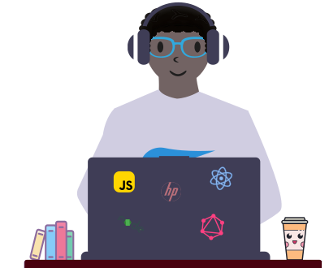

<!-- AUTO-GENERATED-CONTENT:START (STARTER) -->
<p align="center">
    
</p>
<h1 align="center">
  Marlon Johnson - Me
</h1>

This is my personal site **portfolio site soon to be** used as a reference to show what I;m currently working on and things I've written.

## 🚀 Quick start

First, clone the repo:

```
git clone https://github.com/Mvrs/saschamars.me.git
```

Then install dependencies:

```
cd me && yarn install
```

Then run using Gatsby **if you haven't install `gastby-cli`**

```
gatsby develop or yarn develop
```

## 🧐 What's Inside?

The site is built using Gatsby, utilizing a handful of plugins used for pulling data, optimizing images, and bringing the site to life

- the Gatsby image plugin used to optimize images on load that prefetches on subsequent page loads
- theme UI to leverage many ways to create customized style components
- customized hooks
- a Gatsby plugin for implementing SVG's in components I've designed in Figma

## ✨ Deploy

For production I used Netlify 🙃

```
yarn build
```
